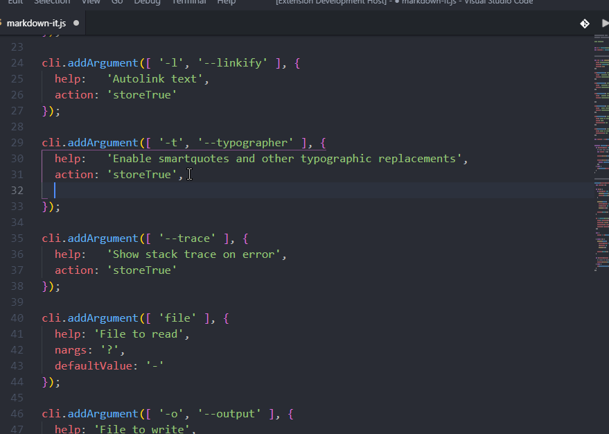

# Surround Selection

Surround select text with custom text input, intended for surrounding text with brackets and quotes.

Inspired by the Sublime Text extension.

Adds a `Surround Selection` command that prompts for a string that will surround the selected text.

